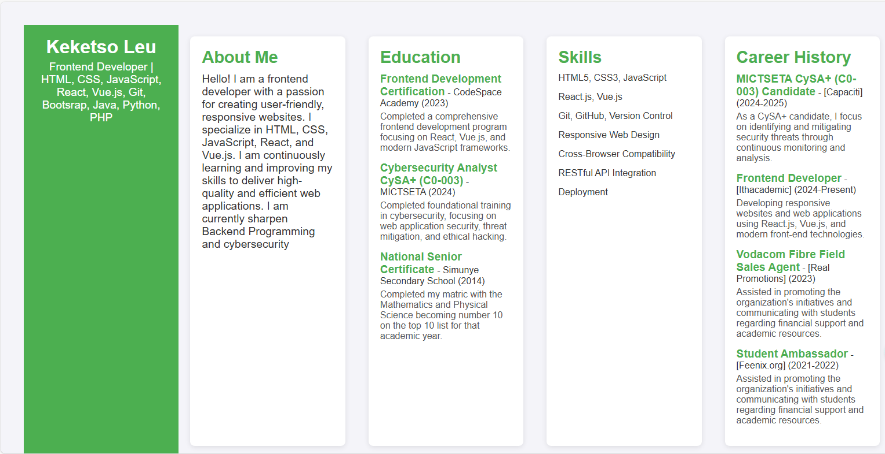

# Frontend Developer CV



A **single-page CV** showcasing my skills, education, and career history as a frontend developer. This project uses **HTML** to create a well-structured, semantic CV that is ready to be styled and customized further.

## 🚀 Table of Contents
- [About the Project](#about-the-project)
- [Features](#features)
- [Tools Used](#tools-used)
- [Installation Instructions](#installation-instructions)
- [Preview](#preview)
- [License](#license)

## 🧑‍💻 About the Project

This **Frontend Developer CV** project demonstrates my expertise in:
- Web Development (HTML5, CSS3, JavaScript)
- Responsive Design
- Semantic HTML for better accessibility
- Incorporating SEO and Open Graph meta tags for better visibility

The CV is divided into multiple sections:
- **About Me**
- **Education**
- **Skills**
- **Career History**

### Why this project?
This CV is designed to showcase my technical expertise in frontend development, and it is built using only **HTML** at this stage. The **CSS styling** will be added in a future project to enhance its appearance.

## 🎨 Features

- **Responsive Design** for different screen sizes (mobile-first approach).
- **Semantic HTML** for better SEO and accessibility.
- **SEO meta tags** and **Open Graph** tags for better social media sharing.
- **Favicon** for a personalized touch.

## 🛠️ Tools Used

- **HTML5** - The backbone of the page structure.
- **CSS3** - For styling (to be implemented in a future version).
- **Git** - Version control and collaboration.
- **Visual Studio Code** - Code editor.
- **GitHub** - Hosting and version control.
- **Open Graph Tags** - For social media optimization.

## 🔧 Installation Instructions

Follow these steps to set up and run this project on your local machine:

1. Clone this repository to your local machine:
    ```bash
    git clone https://github.com/shakes224/SAP-Resume
    ```

2. Navigate to the project directory:
    ```bash
    cd frontend-cv
    ```

3. Open `index.html` in any browser to view your CV.

4. Optionally, use a local development server for live previews (like [Live Server](https://marketplace.visualstudio.com/items?itemName=ritwickdey.LiveServer)).

## 🌍 Preview

Here’s a preview of how the **Frontend Developer CV** will look:


## 📜 License

This project is licensed under the **MIT License**.

---

Feel free to contribute or fork this repository. You can submit issues or pull requests to enhance this CV. 

<<<<<<< HEAD
For any questions or inquiries, feel free to reach out to me at **keketsoleu12@gmaill.com**.
=======
For any questions or inquiries, feel free to reach out to me at **keketsoleu12@gmail.com**.
>>>>>>> 789608369d5eef1bdf9474e71de11954e6a8eeeb
